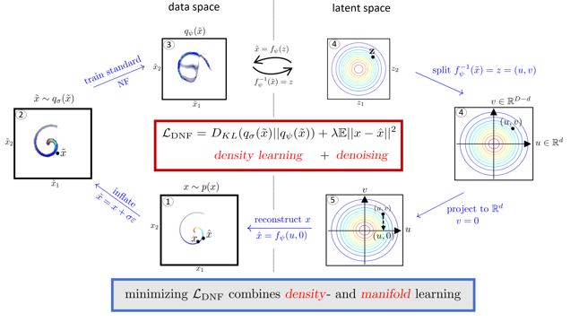

# Denoising Normalizing Flow

*Christian Horvat and Jean-Pascal Pfister 2021*

We combine Normalizing Flows (NFs) and Denoising Auto Encoder (DAE) by introducing the [Denoising Normalizing Flow ](https://proceedings.neurips.cc/paper/2021/hash/4c07fe24771249c343e70c32289c1192-Abstract.html) (DNF), a generative model able to
1. approximate the data generating density p(x),
2. generate new samples from p(x),
3. infer low-dimensional latent variables.

As a classical NF degenerates for data living on a low-dimensional manifold embedded in high dimensions, the DNF inflates the manifold valued data using noise and learns a denoising mapping similar to DAE.

### Related Work

The DNF is highly related to the [Manifold Flow](https://github.com/johannbrehmer/manifold-flow) introduced by Johann Brehmer and Kyle Cramner. Also, our code is a carbon copy of their implementation with the following additions:

1. The data can be inflated with Gaussian noise.
2. We include the DNF as a new mode for the ℳ-flow.
3. A new dataset, the thin spiral, was added.
4. A new folder, [experiments/plots](experiments/plots), for generating the images from the paper was added.
5. A new folder, [experiments/benchmarks](experiments/benchmarks), for benchmarking the DNF was added.
6. The evaluate.py was modified and now includes the grid evaluation for the thin spiral and gan2d image manifold, the latent interpolations, the density estimation for the PAE, the latent density estimation on the thin spiral, and the KS statistics for the circle and sphere experiments.

The theoretical foundation of the DNF was developed in [Density estimation on low-dimensional manifolds: an inflation-deflation approach](https://arxiv.org/abs/2105.12152).

### Data sets

We trained the DNF and ℳ-flow on the following datasets:

Data set | Data dimension | Manifold dimension | Arguments to `train.py`, and `evaluate.py`
--- | --- | --- | ---
Thin spiral | 2 | 1 |  `--dataset thin_spiral`
2-D StyleGAN image manifold | 64 x 64 x 3 | 2 |  `--dataset gan2d`
64-D StyleGAN image manifold | 64 x 64 x 3 | 64 |  `--dataset gan64d`
CelebA-HQ | 64 x 64 x 3 | ? |  `--dataset celeba`

To use the model for your data, you need to create a simulator (see [experiments/datasets](experiments/datasets)), and add it to [experiments/datasets/__init__.py](experiments/datasets/__init__.py). If you have problems with that, please don't hesitate to contact us.

### Benchmarks

We benchmark the DNF with the ℳ-flow, [Probabilistic Auto Encoder](https://arxiv.org/abs/2006.05479) (PAE), and [InfoMax Variational Autoencoder](https://github.com/AliLotfi92/InfoMaxVAE). For that, we rely on the original implementations of those models, and modify them where appropriate, see [experiments/benchmarks/vae](experiments/benchmarks/vae) and [experiments/benchmarks/pae](experiments/benchmarks/pae) for more details.

### Training & Evaluation

The configurations for the models and hyperparameter settings used in the paper can be found in [experiments/configs](experiments/configs). 

### Acknowledgements

We thank Johann Brehmer and Kyle Cramner for publishing their implementation of the [Manifold Flow](https://github.com/johannbrehmer/manifold-flow). For the experiments with the [Probabilistic Auto-Encoder](https://github.com/VMBoehm/PAE) (V. Böhm and U. Seljak) and [InfoMax Variational Autoencoder](https://github.com/AliLotfi92/InfoMaxVAE) (A.L. Rezaabad, S. Vishwanath), we used the official implementations of these models. We thank these authors for this possibility.
